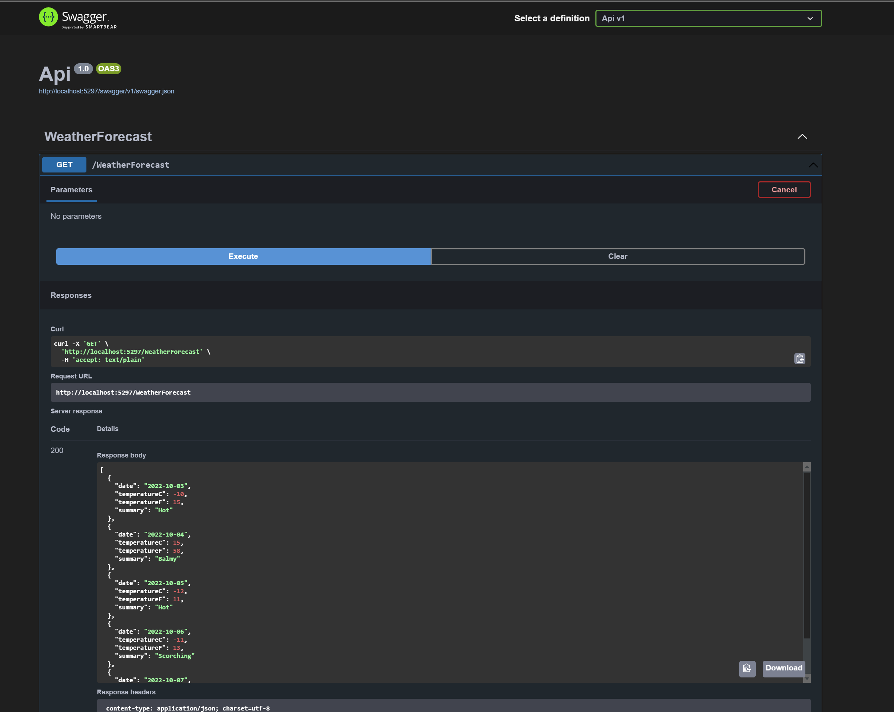

# .NET SWAGGER DARK MODE

## Back-End

- Net 7
- Swagger

## Program.cs

```c#
if (app.Environment.IsDevelopment())
{
    app.UseSwagger();
    app.UseSwaggerUI(c => c.InjectStylesheet("/swagger-ui/SwaggerDark.css"));
}

app.UseStaticFiles();
```

## Swagger


